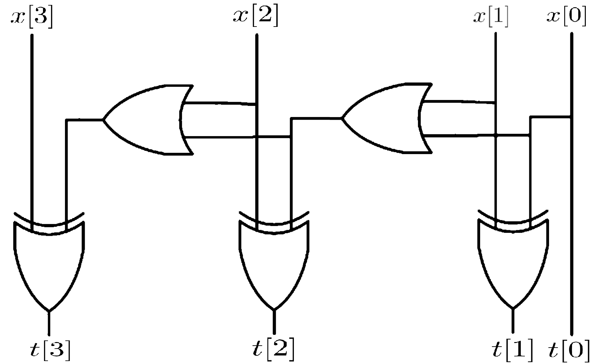
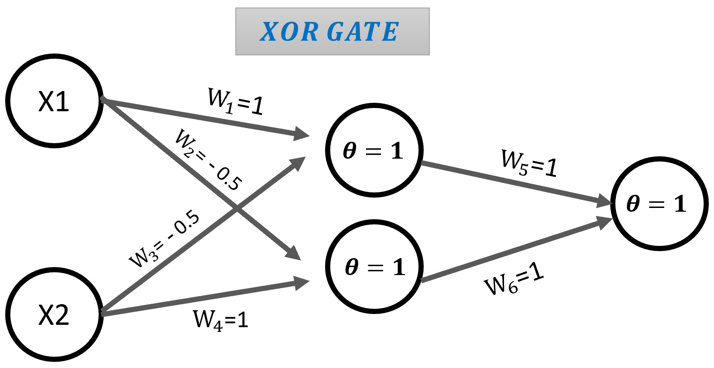
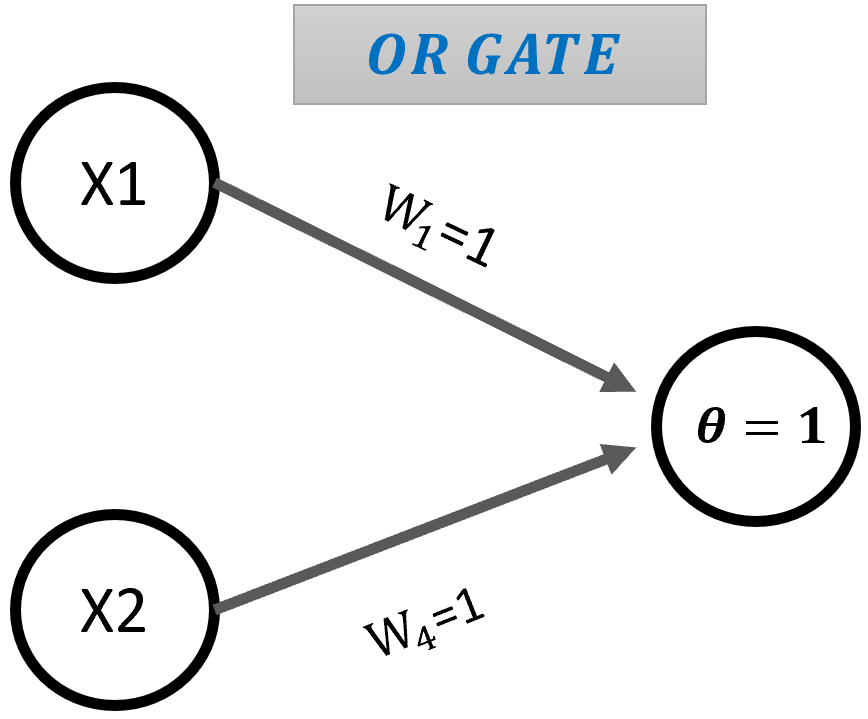
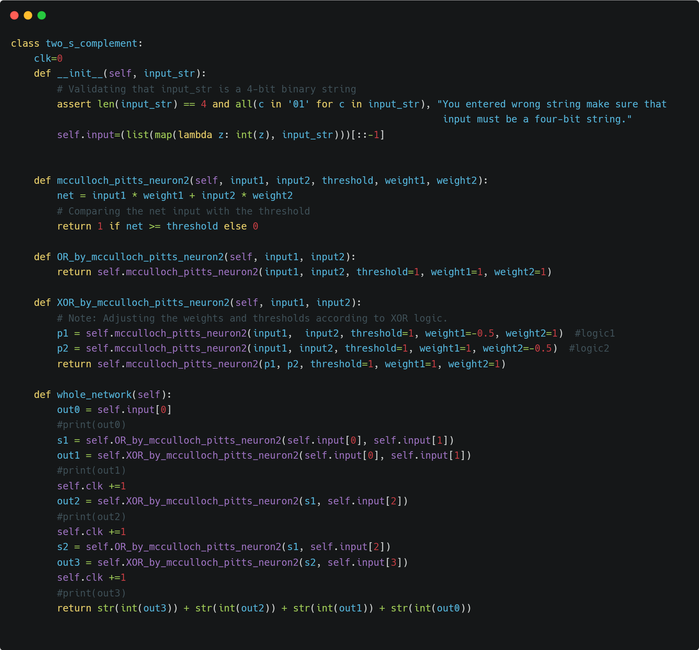

# Implementing-4-bit-two-s-complement-arithmetic-using-McCulloch-Pitts-neurons
Here you will get familiar with the simple implementation of digital circuits using McCulloch-Pitts neurons.


One of the approaches for implementing a 4-bit two's complement digital circuit at the gate level is based on XOR-OR implementation.



<p><em>Figure 1: Gate-level implementation of a 4-bit two's complement circuit.</em></p>

To implement the presented circuit based on McCulloch-Pitts neurons, the XOR and OR structures can be replaced with their equivalent structures consisting of McCulloch-Pitts neurons, or simply MP neurons.

Additionally, considering all possible inputs, the output of this digital circuit should produce a truth table similar to Table 1. To quickly find the two's complement, which is equivalent to adding one single binary bit to the one's complement of that number, you can keep the bits from the rightmost bit up to the first encountered 1 unchanged, and invert the remaining bits (changing 1 to 0 and vice versa).

|  | **Binary Number** | **Two's Complement** |
| --- | --- | --- |
| 0 | 0000 | 0000 |
| 1 | 0001 | 1111 |
| 2 | 0010 | 1110 |
| 3 | 0011 | 1101 |
| 4 | 0100 | 1100 |
| 5 | 0101 | 1011 |
| 6 | 0110 | 1010 |
| 7 | 0111 | 1001 |
| 8 | 1000 | 1000 |
| 9 | 1001 | 0111 |
| 10 | 1010 | 0110 |
| 11 | 1011 | 0101 |
| 12 | 1100 | 0100 |
| 13 | 1101 | 0011 |
| 14 | 1110 | 0010 |
| 15 | 1111 | 0001 |

**Table 1:** Truth Table for 4-bit Binary Numbers and Their Two's Complement

### Network Theory Implementation

The neuron models based on XOR and OR along with their weights can be seen in Figures \ref{h3} and \ref{h2}.


|||
| --- | --- |
|<p><em>Figure 2: MP Neuron-Based XOR Implementation.</em></p>|<p><em>Figure 3: MP Neuron-Based OR Implementation.</em></p>|


The weights obtained in the models shown in Figures 2, 3 are based on comparing the performance of MP neurons with the truth tables of the desired digital gates. By utilizing these implemented models and the digital circuit in Figure 1, the final network for the two's complement circuit can be formed based solely on a network of MP neurons.


<p><em>Figure 4: The implemented two's complement circuit consisting of MP neurons.</em>


To fully implement the digital circuit based on neurons, it is sufficient to first use the weights obtained in the previous section to implement the digital gates used in this circuit XOR and OR based on MP neurons.


OR Implementation

```plaintext
def OR_by_mcculloch_pitts_neuron2(self, input1, input2):
    return self.mcculloch_pitts_neuron2(input1, input2, threshold=1, weight1=1, weight2=1)
```

XOR Implementation

```plaintext
def XOR_by_mcculloch_pitts_neuron2(self, input1, input2):
    # Note: Adjusting the weights and thresholds according to XOR
    p1 = self.mcculloch_pitts_neuron2(input1,  input2, threshold=1, weight1= - 5.0, weight2=1 )  #logic1
    p2 = self.mcculloch_pitts_neuron2(input1, input2, threshold=1, weight1=1, weight2= - 5.0 )  #logic2
    return self.mcculloch_pitts_neuron2(p1, p2, threshold=1, weight1=1, weight2=1)
```

MP Neuron Implementation

```plaintext
def mcculloch_pitts_neuron2(self, input1, input2, threshold, weight1, weight2):
  net = input1 * weight1 + input2 * weight2
  # Comparing the net input with the threshold
  return 1 if net >= threshold else 0
```


In the next step, the gates implemented based on MP neurons are sequentially arranged (as shown in Figure 1). The propagation delay of each XOR and OR gate is considered to be one clock cycle. Therefore, the total propagation delay of this circuit, which occurs in the critical path, can be considered as 3 clock cycles. This is because the most delay-intensive path in this circuit requires passing through 3 gates. This has been taken into account in the implementation as well. The complete implementation of the 4-bit two's complement class based on neurons is shown in Figure 2.



<p><em>Figure 5: The codes related to the implemented network shown in Figure 4 </em>

The output of the implemented network shown in Figure 5 for an arbitrary input is as follows.

```plaintext
		input of the network was  0101
		Output of the whole network (2's complement of 0101) is: 1011
		It takes 3 clock
```


The output of the network implemented using MP neurons for all possible states of a 4-bit input is shown below. These outputs fully match the provided truth table.


```plaintext
0  -   0000 ===> Our 2's complement network ===> 0000
1  -   0001 ===> Our 2's complement network ===> 1111
2  -   0010 ===> Our 2's complement network ===> 1110
3  -   0011 ===> Our 2's complement network ===> 1101
4  -   0100 ===> Our 2's complement network ===> 1100
5  -   0101 ===> Our 2's complement network ===> 1011
6  -   0110 ===> Our 2's complement network ===> 1010
7  -   0111 ===> Our 2's complement network ===> 1001
8  -   1000 ===> Our 2's complement network ===> 1000
9  -   1001 ===> Our 2's complement network ===> 0111
10 -   1010 ===> Our 2's complement network ===> 0110
11 -   1011 ===> Our 2's complement network ===> 0101
12 -   1100 ===> Our 2's complement network ===> 0100
13 -   1101 ===> Our 2's complement network ===> 0011
14 -   1110 ===> Our 2's complement network ===> 0010
15 -   1111 ===> Our 2's complement network ===> 0001
```


